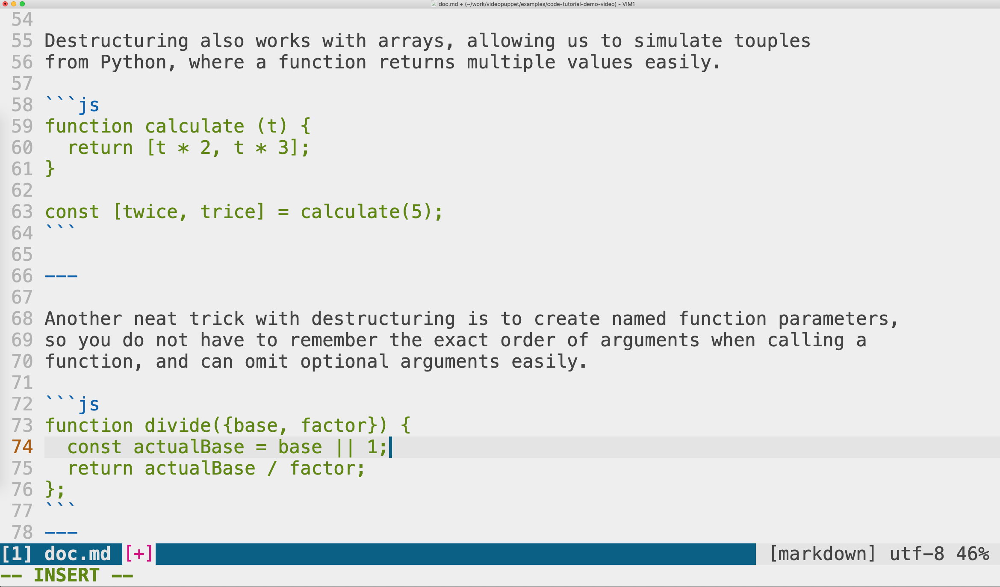

```md
# ES6 Destructuring!
```

(pause: 2)

---

```md
# ES6 Destructuring!

* unpack values from complex objects into variables
* eg from an **array** into **elements**
* eg from an **object** into **properties**
```

ES6 object destructuring is a wonderful feature that can remove a lot of boilerplate code, 
and help you write cleaner functions. In short, it lets us unpack values from arrays, 
or properties from objects, into distinct variables.

---


Here's an example without destructuring. 

We create a complex object, and then unpack individual fields into variables for easier usage.

```js
const obj = JSON.parse(stringContent),
  name = obj.name,
  rank = obj.rank;
```

---


Here is the same example with destructuring. 

The code is much shorter. 

We do not need an intermediate variable at all.

```js
const {name, rank} = JSON.parse(...);
```
---

Destructuring also works with arrays, allowing us to simulate touples 
from Python, where a function returns multiple values easily.

```js
function calculate (t) { 
  return [t * 2, t * 3];
}

const [twice, trice] = calculate(5);
```

---

Another neat trick with destructuring is to create named function parameters, 
so you do not have to remember the exact order of arguments when calling a 
function, and can omit optional arguments easily.

```js
function divide({base, factor}) {
  const actualBase = base || 1;
  return actualBase / factor;
};
```
---

Here's a quick demo. Try this in your console:

(video:
  file: node-demo.mp4
  segment: 0-4)

---
(transition: none)

We can call this function with both arguments:

(video:
  file: node-demo.mp4
  segment: 5-15
  sync: match)

---

(transition: none)

We can also call it with a different order of parameters:

(video:
  file: node-demo.mp4
  segment: 15-25
  sync: match)

---
(transition: none)

Or skip the first argument completely:

(video:
  file: node-demo.mp4
  segment: 25-32
  sync: match)

(pause: 1)

---

```md
# This video was built 
# from Markdown
```

You can create videos like this one easily using Narakeet. 

---

Just create a markdown script with the narration, and upload it 
along with your assets. The voice you hear now was generated 
from a markdown script.




---

```md
## Create narrated videos easily

* Automate narration
* Automatically synchronise audio and video
* Render code snippets on top of videos or images
* Source control and CI for videos!
```

Stop wasting time on recording voice, synchronising picture with sound and adding subtitles.

Let Narakeet do all the dull tasks, so you can focus on the content.

---

Download the source of this video and check out more information at narakeet.com

```md
## narakeet.com
```
(pause: 3)
