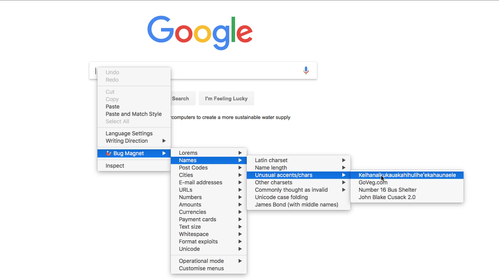
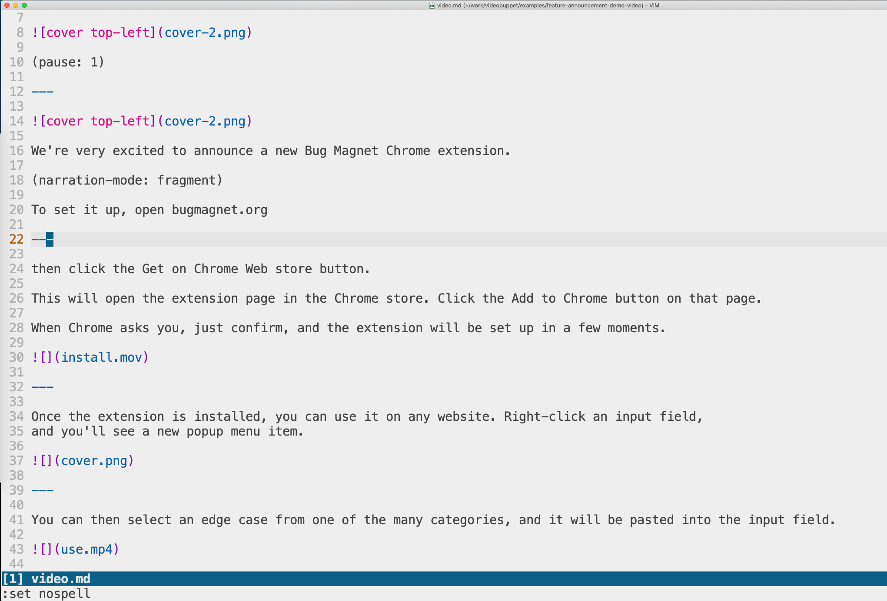

(pause: 1)

---


We're very excited to announce a new Bug Magnet Chrome extension.

(narration-mode: fragment)

To set it up, open bugmagnet.org

---

then click the Get on Chrome Web store button.

This will open the extension page in the Chrome store. Click the Add to Chrome button on that page.

When Chrome asks you, just confirm, and the extension will be set up in a few moments.


---

Once the extension is installed, you can use it on any website. Right-click an input field,
and you'll see a new popup menu item.



---

You can then select an edge case from one of the many categories, and it will be pasted into the input field.


---




(transition: 1)

```md
# Created using Narakeet 
# from a Markdown script
```

(pause: 1.5)

You can create quick announcement videos like this one in just a few minutes using Narakeet.

---


Type up the narration script and upload it along with your assets. And that's it.

Narakeet will resize assets, align and synchronise everything, and even generate life-like narration voiceover.


---

```md
## Create narrated videos easily

* Automate narration
* Automatically synchronise audio and video
* Render code snippets on top of videos or images
* Source control and CI for videos!
```

The voice you hear now was generated automatically from a script.

Stop wasting time on recording voice, synchronising picture with sound and adding subtitles.

Let Narakeet do all the dull tasks, so you can focus on the content.

---

Download the source of this video and check out more information at narakeet.com

```md
## narakeet.com
```
(pause: 3)
