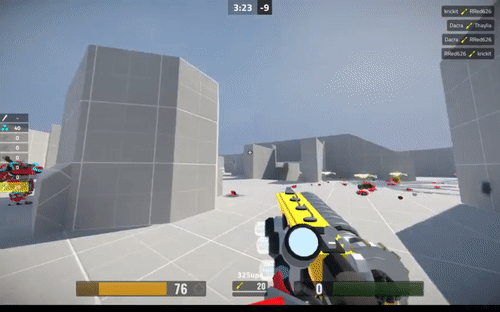

Animated gifs will play in a loop, for the duration of the narration. 

---

Use the freeze synchronization option to play just one loop and freeze.

---

> without narration, they will play only one cycle.

---

(pause: 5)

> add a pause stage direction to loop the image without narration.
