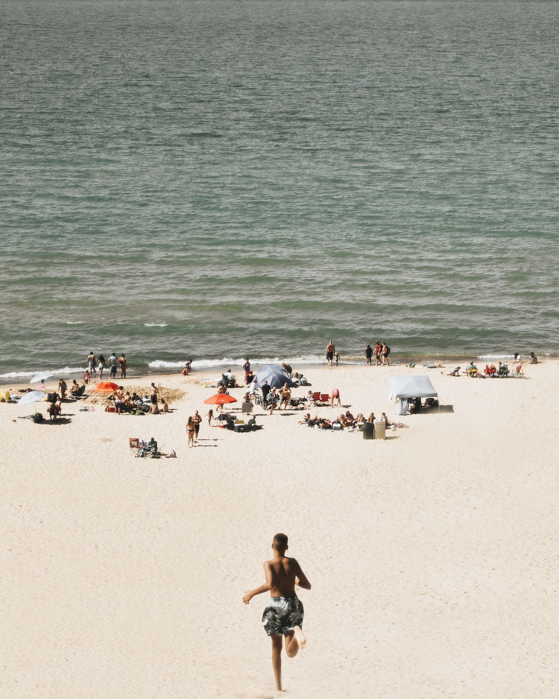

<!-- Video Puppet will show fenced code blocks as slides -->

```
Hi there!
```

---

(duration: 2)

<!-- set the block language to md to render markdown on screen -->
```md
# Heading 1
## Heading 2

* bullets are left-aligned
* bullet 2
  * sub-bullet
```

---

<!-- set the block language for syntax highlighting -->
```css
.container {
  align-items: center;
  display: flex;
  justify-content: center;
  height: 100%;
  width: 100%;
  padding: 40px;
}
```


(duration: 2)

---


(font-size: 20)

<!-- set the font size using the (font-size) stage direction -->

```css
.container {
  align-items: center;
  display: flex;
  justify-content: center;
  height: 100%;
  width: 100%;
  padding: 40px;
}
```

> smaller font size using (font-size: 20)

(duration: 2)

---

<!-- video puppet shows slides over images -->

```
Penguins!
```



(duration: 2)

---

<!-- use the theme stage direction to switch to lighter colors for a dark background -->

(theme: light)

<!-- video puppet shows slides over videos -->

```
Start counting!
```


